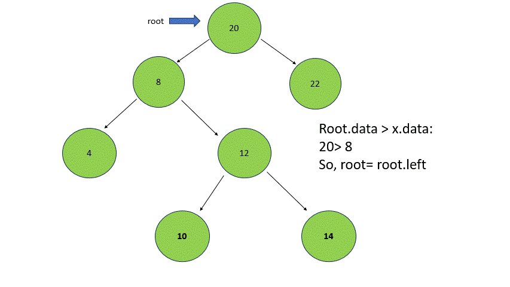

# Inorder Success or of BST

## Question
https://www.geeksforgeeks.org/problems/inorder-successor-in-bst/1?page=1&category=Binary%20Search%20Tree&sortBy=submissions

Given a BST, and a reference to a Node x in the BST. Find the Inorder Successor of the given node in the BST.
 
```
Example 1:

Input:
      2
    /   \
   1     3
K(data of x) = 2
Output: 3 
Explanation: 
Inorder traversal : 1 2 3 
Hence, inorder successor of 2 is 3.
```

```
Example 2:

Input:
             20
            /   \
           8     22
          / \
         4   12
            /  \
           10   14

K(data of x) = 8
Output: 10
Explanation:
Inorder traversal: 4 8 10 12 14 20 22
Hence, successor of 8 is 10.
 ```

Your Task:

You don't need to read input or print anything. Your task is to complete the function inOrderSuccessor(). This function takes the root node and the reference node as argument and returns the node that is inOrder successor of the reference node. If there is no successor, return null value.


Expected Time Complexity: O(Height of the BST).

Expected Auxiliary Space: O(1).


Constraints:
1 <= N <= 105, where N is number of nodes

## Approach
1. We know that the inorder traversal of BST is always sorted, so we need to the find the node which is immediate greater than the current node


2. We can start traversing the root, keeping a succ variable.

3. If the current node is less than or equal the given node, it cannot be a possible answer and we will not be able to find the successor in the left subtree of the current node, hence we will move to the right subtree.

4. If we find a node greater than the given node, we can store it as a successor because it can be a possible answer, and as the curr is greater, all the nodes in the left subtree will be greater than the current node hence, we will find for the left subtree.

5. If the current node is null, we can say that the previously stored successor is the answer.

## Pseudocode

```
    succ = null

    while(root is not null){
        if(root > given node){
            succ =  root
            move to left subtree
        }
        else{
            move to right subtree
        }
    }

    succ is the answer.

```

## Code
```cpp
Node * inOrderSuccessor(Node *root, Node *x)
    {
        
        Node* succ = nullptr;
        
        while(root){
            if(root->data > x->data){
                succ = root;
                root = root->left;
            }
            else{
                root = root->right;
            }
        }
        
        return succ;
    }
```

## Examples
### Example 1
.jpg)
.jpg)

### Example 2



## Edge Cases
1. If the given element is largest, it has no inorder successor.