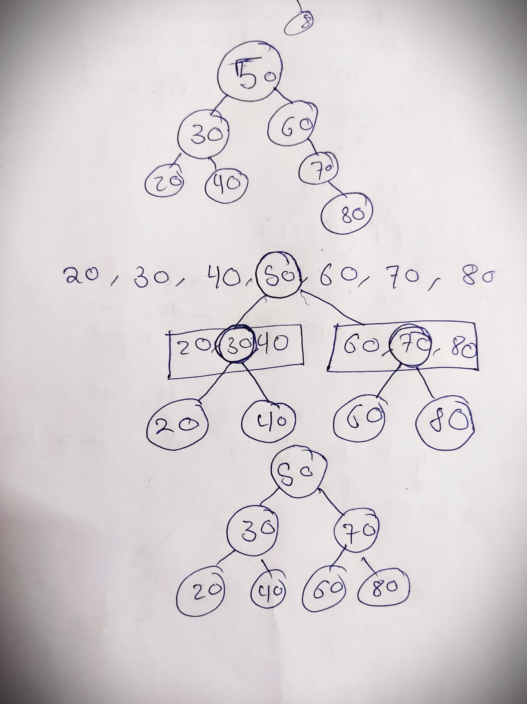

# Normal BST to Balanced BST

## Question
https://www.geeksforgeeks.org/problems/normal-bst-to-balanced-bst/

Given a Binary Search Tree, modify the given BST such that it is balanced and has minimum possible height. Return the balanced BST.
```
Example1:

Input:
       30
      /
     20
    /
   10
Output:
     20
   /   \
 10     30
 ```
 ```
Example2:

Input:
         4
        /
       3
      /
     2
    /
   1
Output:
      3            3           2
    /  \         /  \        /  \
   1    4   OR  2    4  OR  1    3   
    \          /                  \ 
     2        1                    4

```

Your Task:

The task is to complete the function buildBalancedTree() which takes root as the input argument and returns the root of tree after converting the given BST into a balanced BST with minimum possible height. The driver code will print the height of the updated tree in output itself.
 
Expected Time Complexity: O(N)
Expected Auxiliary Space: O(N)
Here N denotes total number of nodes in given BST.

Constraints:
1 <= N <= 10^5

1 <= Node data <= 10^9

## Approach
1. We can create a complete balanced BST using inorder traversal.
2. Find the inorder traversal and store it into an array;
3. Find the mid of the array and create anode from mid.
4. Recursively call the left side array for left of the root and right side of the array for right of the root.

## Code
```cpp
oid findInorder(Node* root, vector<Node*> &in){
        if(root){
            findInorder(root->left, in);
            
            in.push_back(root);
            
            findInorder(root->right, in);
        }
    }
    
    Node* createBST(vector<Node*> &in, int start, int end){
        if(start > end){
            return nullptr;
        }
        
        int mid = start + (end-start)/2;
        
        Node* temp = in[mid];
        
        temp->left = createBST(in, start, mid-1);
        temp->right = createBST(in, mid+1, end);
        
        return temp;
    }
    
    Node* buildBalancedTree(Node* root)
    {
        vector<Node*> inorder;
        findInorder(root, inorder);
        
        return createBST(inorder, 0, inorder.size()-1);
    }
```

## Example
