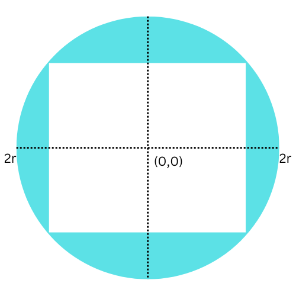
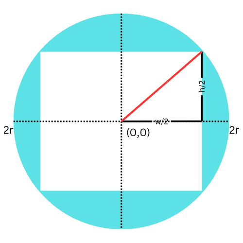

# No. of rectangles in a Circle
## Question
https://www.geeksforgeeks.org/problems/rectangles-in-a-circle0457/1

Given a circular sheet of radius, r. Find the total number of rectangles with integral length and width that can be cut from the sheet that can fit on the circle, one at a time.

Examples :
```
Input: r=1
Output: 1
Explanation: Only 1 rectangle of dimensions 1x1.
```
```
Input: r=2
Output: 8
Explanation: The 8 possible rectangles are 
(1x1)(1x2)(1x3)(2x1)(2x2)(2x3)(3x1)(3x2).
```

Expected Time Complexity: O(r2)<br>
Expected Auxillary Space: O(1)

# Approach
We can iterate over the largest possible values of heights and widths of the rectangles if these can be fitted into the circle then we can count it.

### 1. Circle and Rectangle Diagram
First, consider a circle of radius \( r \) centered at the origin (0, 0).

### 2. Rectangle Inside the Circle
Next, we place a rectangle with width \( w \) and height \( h \) inside this circle. For simplicity, we assume the center of the rectangle coincides with the center of the circle.



### 3. Coordinates of Rectangle Corners
The corners of the rectangle, with the center of the rectangle at the origin, will have coordinates.
```
(w/2, h/2)
```


### 4. Distance from Center to a Corner
We need to check the distance from the center of the circle (which is also the center of the rectangle) to one of the rectangle's corners. Using the Pythagorean theorem, the distance to the farthest corner  is:


### **&radic;(w/2)<sup>2</sup>+(h/2)<sup>2</sup>**

### 5. Visualization of the Distance
To visualize this, we draw a line from the center of the circle to one of the rectangle's corners:



### 6. Mathematical Derivation
For the rectangle to fit inside the circle, this distance must be less than or equal to the radius \( r \):

### **&radic;(w/2)<sup>2</sup>+(h/2)<sup>2</sup> <= r**

### 7. Squaring Both Sides
To simplify this condition, we square both sides:

### **(w/2)<sup>2</sup>+(h/2)<sup>2</sup> <= r<sup>2</sup>**


Since the largest value of the length and width can only be `2*r` and maximum corner distance of a rectangle to be fitted into the circle can be checked using:

```
w*w + h*h <= 4*r*r
```

## Code
```cpp
int rectanglesInCircle(int r) {
        // code here
        int ans = 0;
        for(int h = 1; h<=2*r; h++){
            for(int w = 1; w<=2*r; w++){
                if((w*w)+(h*h) <= 4*r*r) ans++;
            }
        }
        
        return ans;
    }
```