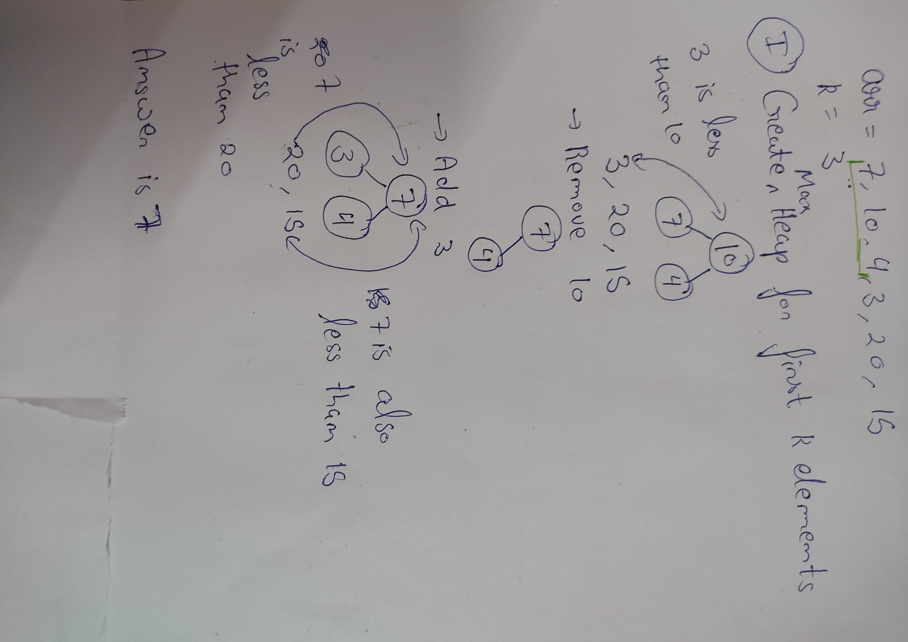
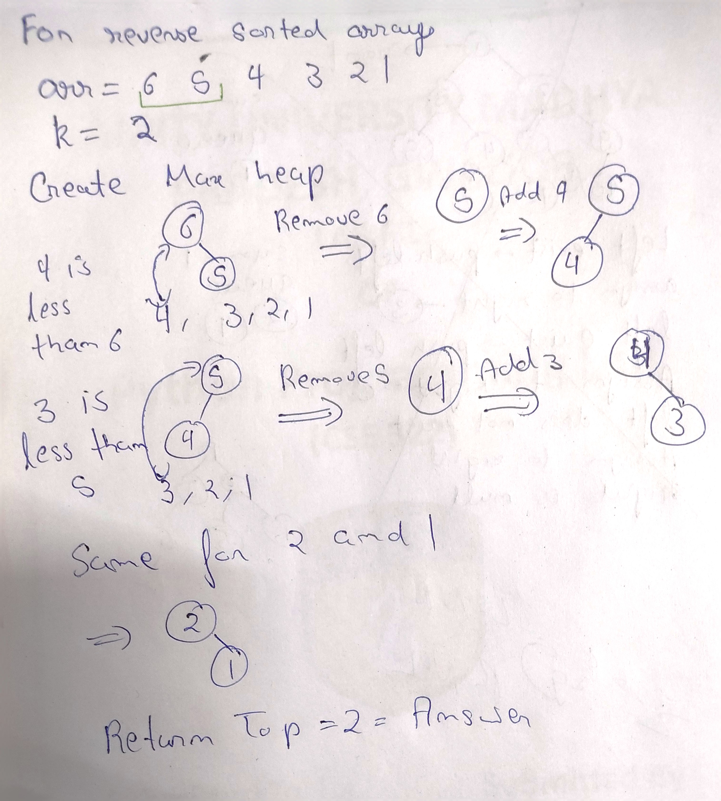

# Kth Smallest Element
## Question
https://www.geeksforgeeks.org/problems/kth-smallest-element5635/1
Given an array arr[] and an integer K where K is smaller than size of array, the task is to find the Kth smallest element in the given array. It is given that all array elements are distinct.

Note :-  l and r denotes the starting and ending index of the array.
```
Example 1:

Input:
N = 6
arr[] = 7 10 4 3 20 15
K = 3
L=0 R=5

Output : 7
Explanation :
3rd smallest element in the given 
array is 7.
```

```
Example 2:

Input:
N = 5
arr[] = 7 10 4 20 15
K = 4 L=0 R=4
Output : 15
Explanation :
4th smallest element in the given 
array is 15.
```
Your Task:

You don't have to read input or print anything. Your task is to complete the function kthSmallest() which takes the array arr[], integers l and r denoting the starting and ending index of the array and an integer K as input and returns the Kth smallest element.
 
 
Expected Time Complexity: O(n*log(n) )

Expected Auxiliary Space: O(log(n))

Constraints:
1 <= N <= 10^5

 L==0,
 R==N-1

1<= arr[i] <= 10^5

1 <= K <= N

## Approach 1 (Using Heap Sort)
1. Build a maxHeap from the array.
2. Sort the array using heapsort HeapSort.
3. Return the K-1th element from sorted array.

*NOTE -In this approach the array will be sorted*

T.C. - O(nlogn)<br>
S.C. - O(logn)

## Code
```cpp
// Creating Heap
    void createHeap(int arr[],int n){
        int largest = n/2;
        
        for(int i = largest; i>=0; i--){
            heapify(arr, n, i);
        }
    }
    
    
    // Code for heapify
    void heapify(int arr[], int n, int i){
        int largest = i;
        int left = 2*i+1;
        int right = 2*i+2;
        
        if(left <= n && arr[left] > arr[largest]) largest = left;
        if(right <= n && arr[right] > arr[largest]) largest = right;
        
        if(largest != i){
            swap(arr[i], arr[largest]);
            heapify(arr, n , largest);
        }
    }
    
    
    // Heapsort
    void heapSort(int arr[], int n){
        while(n > 0){
            swap(arr[0], arr[n]);
            
            n--;
            
            heapify(arr, n, 0);
        }
    }
    
    int kthSmallest(int arr[], int l, int r, int k) {
         createHeap(arr,r);
         
         heapSort(arr, r);
         
         int min = arr[k-1];
         
         return min;
    }
```

## Approach 2:
1. Create a maxHeap from the first K elements.
2. Iterate the rest of the array, if the top of the heap is greater than the current element, remove the top and add the current element into the heap.
3. Return the top of the heap.

*NOTE - If we use priority queues the time complexity will be O(n)*

## Code
```cpp
 int kthSmallest(int arr[], int l, int r, int k) {
         priority_queue<int> q;
         
         for(int i = 0; i<k; i++){
             q.push(arr[i]);
         }
         
         for(int i = k; i<=r; i++){
             if(arr[i] < q.top()){
                 q.pop();
                 q.push(arr[i]);
             }
         }
         
         return q.top();
    }
```

## Dry Run(Approach 2)


For Reverse Sorted array

