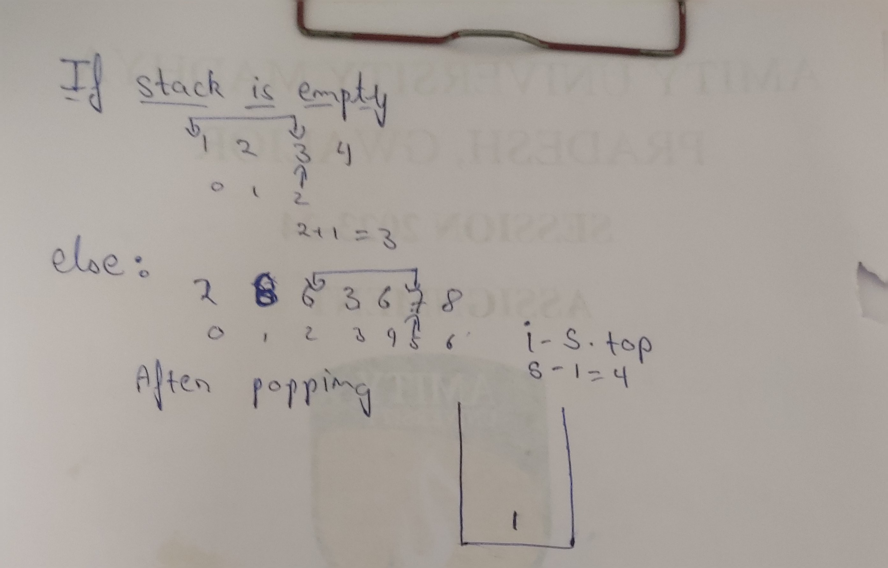
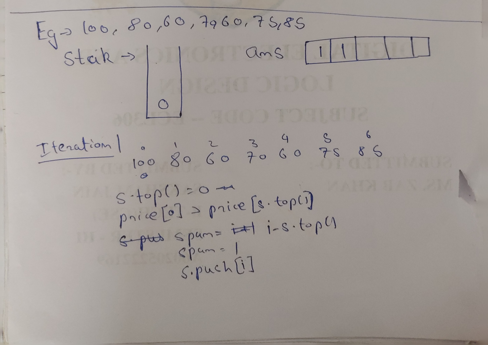
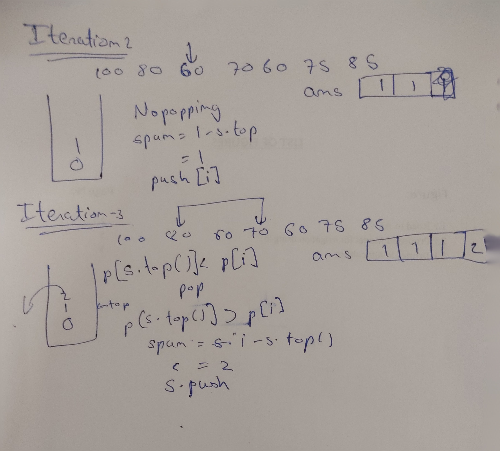

# Stock Spanning Problem

## Question

https://www.geeksforgeeks.org/problems/stock-span-problem-1587115621/1<br><br>
The stock span problem is a financial problem where we have a series of n daily price quotes for a stock and we need to calculate the span of stocks price for all n days.
The span Si of the stocks price on a given day i is defined as the maximum number of consecutive days just before the given day, for which the price of the stock on the given day is less than or equal to its price on the current day.
For example, if an array of 7 days prices is given as {100, 80, 60, 70, 60, 75, 85}, then the span values for corresponding 7 days are {1, 1, 1, 2, 1, 4, 6}.

### Example 1:

**Input:**<br>
N = 7,<br> price[] = [100 80 60 70 60 75 85]<br>
**Output:**<br>
1 1 1 2 1 4 6<br>
Explanation:<br>
Traversing the given input span <br>
100 is greater than equal to 100 and there are no more elements behind it so the span is 1,<br>
80 is greater than equal to 80 and smaller than 100 so the span is 1,<br>
60 is greater than equal to 60 and smaller than 80 so the span is 1,<br>
70 is greater than equal to 60,70 and smaller than 80 so the span is 2,<br>
60 is greater than equal to 60 and smaller than 70 so the span is 1,<br>
75 is greater than equal to 60,70,60,75 and smaller than 100 so the span is 4,<br>
85 is greater than equal to 80,60,70,60,75,85 and smaller than 100 so the span is 6. <br>
Hence the output will be 1 1 1 2 1 4 6.<br>

**Example 2:**

Input: <br>
N = 6, price[] = [10 4 5 90 120 80]<br>
Output:<br>
1 1 2 4 5 1<br>
Explanation:<br>
Traversing the given input span <br>
10 is greater than equal to 10 and there are no more elements behind it so the span is 1,<br>
4 is greater than equal to 4 and smaller than 10 so the span is 1,<br>
5 is greater than equal to 4,5 and smaller than 10 so the span is 2,<br>
90 is greater than equal to all previous elements so the span is 4,<br>
120 is greater than equal to all previous elements so the span is 5,<br>
80 is greater than equal to 80 and smaller than 120 so the span is 1,<br>
Hence the output will be 1 1 2 4 5 1.

**User Task:**

The task is to complete the function calculateSpan() which takes two parameters, an array price[] denoting the price of stocks, and an integer N denoting the size of the array and number of days. This function finds the span of stock's price for all N days and returns an array of length N denoting the span for the i-th day.

Expected Time Complexity: O(N).<br>
Expected Auxiliary Space: O(N).

Constraints:<br>
1 ≤ N ≤ 105<br>
1 ≤ C[i] ≤ 105


## Intuition

If we want to find the range of the span we can use a stack and indices of the array of prices.
We can push the indices of the array to the stack and pop them out until we don't find the index where the price is greater than the current price.

## Approach

1. Take a stack and an answer vector.
2. Push 0 to stack(because first element has no element on left) and 1 to the vector (because the count of elements before first is 1).
3. Iterate the array.
   1. Pop out the stack until it is empty or the price at index which is on top of the stack less than equal to the price at current index.
   2. If the stack is empty the span is i+1(because the stack will be empty if and only if all the prices before that index are less than the price of current index).
   3. Else the price will be i - index at top.(We will get the count of number of elements between the greater element and the current element).
   4. Push the span to ans vector.
   5. Push the current index to stack.
      
4. Return the ans vector.

## Dry Run




## Code

```cpp
    vector <int> calculateSpan(int price[], int n)
    {
       vector<int> counts;
       stack<int> s;
       counts.push_back(1);
       s.push(0);

       for(int i = 1; i<n; i++){
          while(!s.empty() && price[s.top()] <= price[i]) s.pop();
          int span = s.empty()?i+1:i-s.top();
          counts.push_back(span);
          s.push(i);
       }

       return counts;
    }
```

## Resources

https://www.geeksforgeeks.org/the-stock-span-problem/
https://www.javatpoint.com/stock-span-problem
