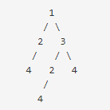

# Duplicate Subtrees

## Question
Given a binary tree, your task is to find all duplicate subtrees from the given binary tree.

*Duplicate Subtree : Two trees are duplicates if they have the same structure with the same node values.*

**Note:**  Return the root of each tree in the form of a list array & the driver code will print the tree in pre-order tree traversal in lexicographically increasing order.



```
Examples:

Input : 
 
Output: 2 4   
        4
Explanation: The above tree have two duplicate subtrees.i.e 
  2
 /
4  and 4. Therefore, you need to return the above tree root in the form of a list.  
```
```
Input:     5
          / \
         4   6
        / \
       3   4
          / \
         3   6
Output: 
3
6
Explanation: In the above tree, there are two duplicate subtrees.i.e
3 and 6. Therefore, you need to return the above subtrees root in the form of a list. Here, 4 3  is not considered because for a subtree to be equal, it should have the same values as well as structure. If we consider the first subtree on the left, it has  
two children, 3 on the left and 4 3 6   on the right. And for the second subtree it has 3 on the left and 6 on the right.
Since the structures are not same for the subtrees hence they are not equal
```
Expected Time Complexity: O(n)<br>
Expected Space Complexity: O(n)

Constraints:
1<= height of binary tree <=10<sup>3</sup>

## Approach
We can use the preorder traversal to store structure of each subtree and store it into a hashmap, if the count of the subtree reaches 2, the we can push the root node to ans.

To store the structure, we need to create the string of each subtree as 
```
subtree = root->data + # + left + # + right
```

#### Example

```
           4
          / \
         3   6
```

This subtree will be stored as

```
3 -> 3##         // beacause 3 has both left and right null
6 -> 6## 

Hence,
4#3###6##
```

## Code
```cpp
    string generate(Node* root, unordered_map<string, int> &subtrees_count, vector<Node*> &ans){
      if(!root) return "";
      
      string left =  generate(root->left, subtrees_count, ans);
      string right =  generate(root->right, subtrees_count, ans);
      
      string subtree = to_string(root->data) + "#" + left + "#" + right; //Creating the subtree
      
      subtrees_count[subtree]++;
      
      if(subtrees_count[subtree] == 2){
          ans.push_back(root);
      }
      
      return subtree;
  }
  
    vector<Node*> printAllDups(Node* root) {
        // Code here
        unordered_map<string, int> subtrees_count;
        vector<Node*> ans;
        generate(root, subtrees_count, ans);
        return ans;
    }
```