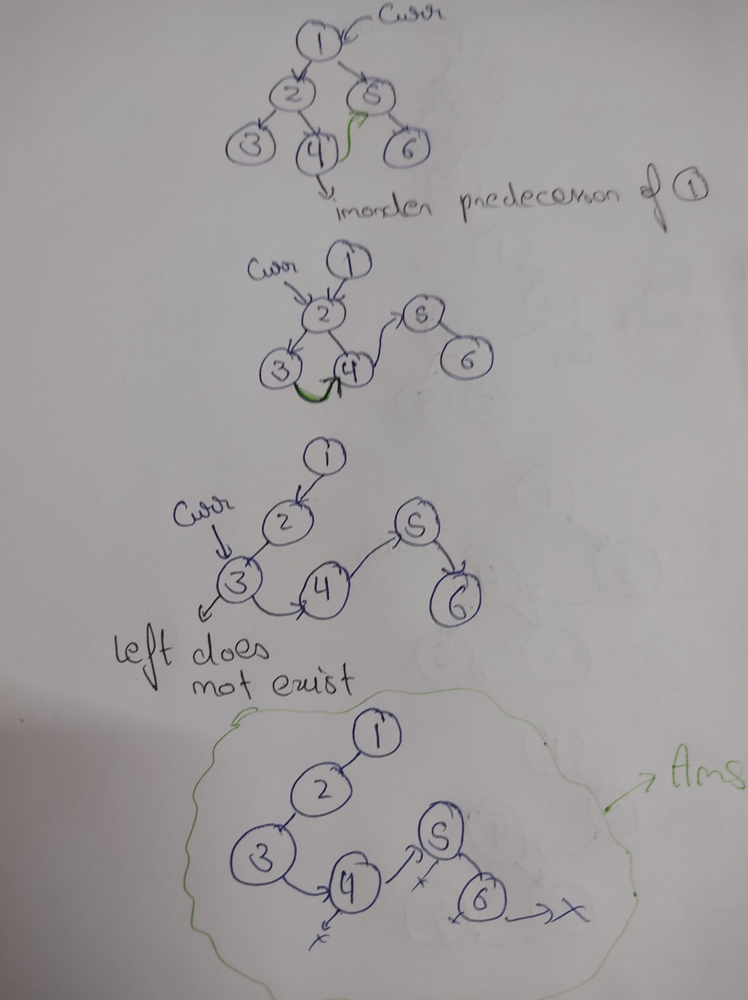
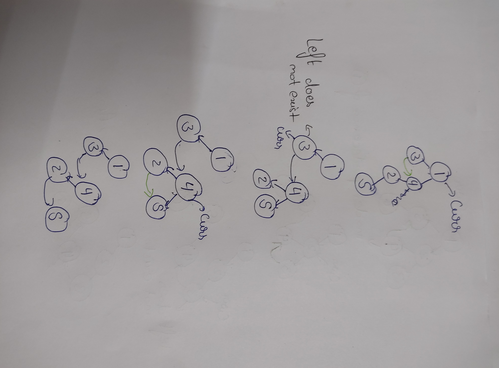

# Question
https://www.geeksforgeeks.org/problems/flatten-binary-tree-to-linked-list/1

Flatten binary tree to linked list
MediumAccuracy: 75.82%Submissions: 36K+Points: 4
Given the root of a binary tree, flatten the tree into a "lLinked list":

The "linked list" should use the same Node class where the right child pointer points to the next node in the list and the left child pointer is always null.
The "linked list" should be in the same order as a pre-order traversal of the binary tree.
```
Example 1:

Input : 
          1
        /   \
       2     5
      / \     \
     3   4     6
Output :
1 2 3 4 5 6 
Explanation: 
After flattening, the tree looks 
like this
    1
     \
      2
       \
        3
         \
          4
           \
            5
             \
              6 
Here, left of each node points 
to NULL and right contains the 
next node in preorder.The inorder 
traversal of this flattened tree 
is 1 2 3 4 5 6.
```
```
Example 2:

Input :
        1
       / \
      3   4
         /
        2
         \
          5 
Output : 
1 3 4 2 5  
Explanation : 
After flattening, the tree looks 
like this 
     1
      \
       3
        \
         4
          \
           2
            \ 
             5 
Here, left of each node points 
to NULL and right contains the 
next node in preorder.The inorder 
traversal of this flattened tree 
is 1 3 4 2 5.
```
Your task:
You don't have to read input or print anything. Your task is to complete the function flatten() which takes the root of the tree and flattens the tree into a linked list without using any auxiliary space.
Note: The driver code prints the in-order traversal of the flattened binary tree.
 
Expected Time Complexity: O(n)

Expected Auxiliary Space: O(1)
 
Constraints :
1<=n<=10^5

# Approach
As we have to create a linked list but we cannot create other nodes and we have to do it inplace.

We will create the linked list as preorder traversal

if the left of the current node exists:

- We will take the root node and then find its inorder predecessor(The rightmost node of the left subtree).

- Then connect the inorder predicessor to its right node.

And then connect the right of current to its left and destroy its left link.

# Algo
```
    while curr is not null:
        if(curr->left):
            inorderPredicessor = curr->left
            while(inorderPredicessor->right):
                inorderPredicessor = inorderPredicessor->right

            inorderPredicessor->right = curr->right
            curr->right = curr->left
            curr->left = nullptr
        
        curr = curr->right
```

# Code
```cpp
void flatten(Node *root)
    {   Node* curr = root;
    
        while(curr != nullptr){
            if(curr->left){
                Node* pred = nullptr;
                pred = curr->left;
                while(pred->right){
                    pred =  pred->right;
                }
                pred->right = curr->right;
                curr->right = curr->left;
                curr->left = nullptr;
            }
            curr =  curr->right;
        }
    }
```

# Examples
## Example 1


## Example 2
