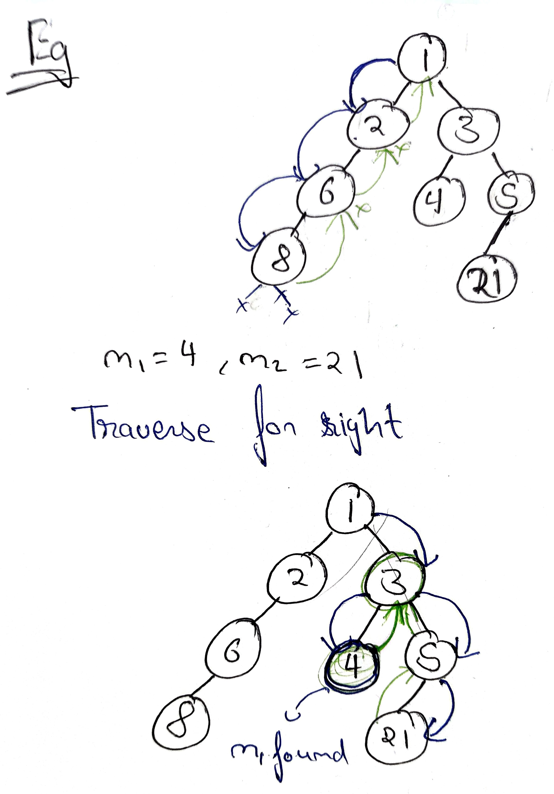

# Lowest Common Ancestor
Question - https://www.geeksforgeeks.org/problems/lowest-common-ancestor-in-a-binary-tree/

Given a Binary Tree with all unique values and two nodes value, n1 and n2. The task is to find the lowest common ancestor of the given two nodes. We may assume that either both n1 and n2 are present in the tree or none of them are present.

LCA: It is the first common ancestor of both the nodes n1 and n2 from bottom of tree.

Example 1:

Input:
n1 = 2 , n2 = 3  
```
       1 
      / \ 
     2   3
```
Output: 1

Explanation:

LCA of 2 and 3 is 1.
Example 2:

Input:

n1 = 3 , n2 = 4
```
           5    
          /    
         2  
        / \  
       3   4
```
Output: 2

Explanation:

LCA of 3 and 4 is 2. 
Example 3:

Input:

n1 = 5 , n2 = 4
```
           5    
          /    
         2  
        / \  
       3   4
```
Output: 5

Explanation:

LCA of 5 and 4 is 5


Your Task:

You don't have to read, input, or print anything. Your task is to complete the function lca() that takes nodes, n1, and n2 as parameters and returns the LCA node as output. 

Expected Time Complexity:O(N).

Expected Auxiliary Space:O(Height of Tree).

Constraints:

1 ≤ Number of nodes ≤ 105

1 ≤ Data of a node ≤ 105

## Approach
1. We will firstly travese till we find the node containing n1 or n2
2. if found return that node.
3. if root is null return null
4. call for the left subtree and store the ans for left.
5. call the right subtree and store the an for right.
6. Check what answers are recieved.
    - if we recieve both left and right hence the current node is the lowest common ancestor because n1 belongs to its left and n2 belongs to its right or vice vesa
    - if null is recieved from left side, return the right side(because left could be on any of its ancestor).
    - if null  is recieved from right side, return the left side(because right could be on any of its ancestor).
    - if null is recieved from both sides return nullptr(this subtree dows not either have left or right)



## Code
```cpp
Node* lca(Node* root ,int n1 ,int n2 )
    {
       if(root == nullptr) return root;
       if(root->data == n1 || root->data == n2) return root;
       
       Node* left = lca(root->left, n1, n2);
       Node* right = lca(root->right, n1, n2);
       
       if(!left && !right){
           return nullptr;
       }
       else if(left && right){
           return root;
       }
       else if(left && !right){
           return left;
       }
       else{
           return right;
       }
    }
```