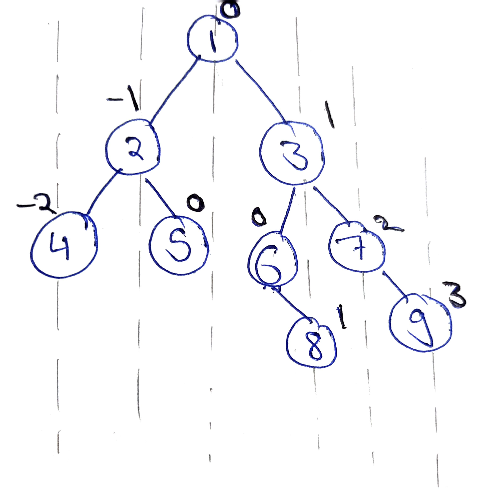
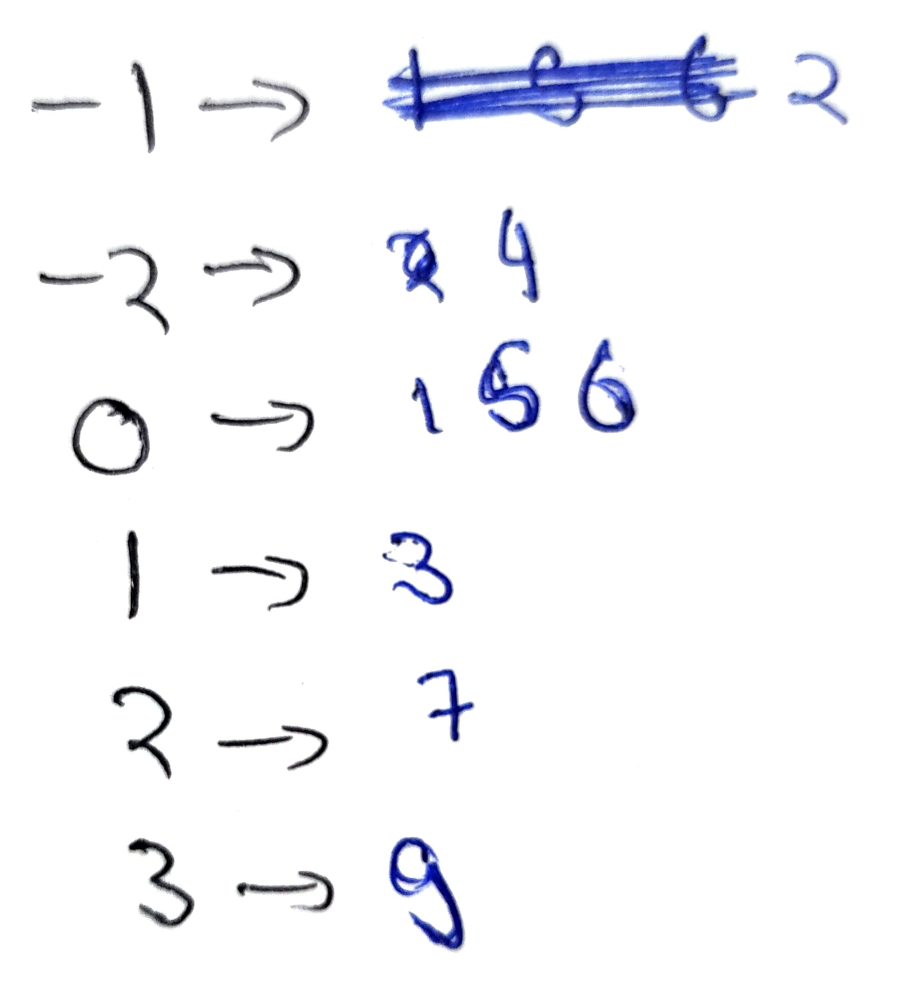
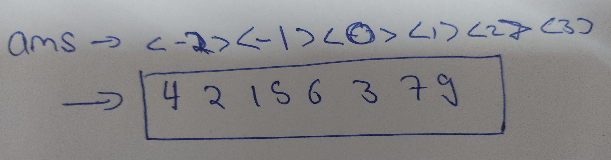

# Find Veritical Traversal
Question - https://www.geeksforgeeks.org/problems/print-a-binary-tree-in-vertical-order/1

Given a Binary Tree, find the vertical traversal of it starting from the leftmost level to the rightmost level.
If there are multiple nodes passing through a vertical line, then they should be printed as they appear in level order traversal of the tree.

Example 1:

Input:
```
           1
         /   \
       2       3
     /   \   /   \
   4      5 6      7
              \      \
               8      9 
```          
Output: 
4 2 1 5 6 3 8 7 9 

Explanation:


Example 2:

Input:
```
       1
    /    \
   2       3
 /    \      \
4      5      6
Output: 4 2 1 5 3 6
```
Your Task:

You don't need to read input or print anything. Your task is to complete the function verticalOrder() which takes the root node as input parameter and returns an array containing the vertical order traversal of the tree from the leftmost to the rightmost level. If 2 nodes lie in the same vertical level, they should be printed in the order they appear in the level order traversal of the tree.

Expected Time Complexity: O(N*log(N))

Expected Auxiliary Space: O(N)

Constraints:

1 <= Number of nodes <= 3*104

## Approach
1. We can plot the horizontal distances of each node from root node.
(The distances can be plotted as same as we use number line)

To plot the distances
- Take the root as 0
- for all nodes left of root decrement distance by one.
- for all nodes right of root increment distance by one.



2. We can then create a mapping of nodes for each level
(We can use a map of int -> vector of nodes)



3. Print values corresponding to map indices from lowest to highest.



## Steps
1. Take an answer vector.
2. If root is null return ans.
3. Take a queue of type pair containing int and Node
    - Integer for distance from root
    - Node is the current node.
4. Create a mapping of int -> vector of nodes.
5. Push pair containing root and distance 0;
6. Iterate till queue is empty.
    - Pop the queue.(This will be a pair)
    - Extract the current node and level from the pair.
    - Push the node to the vector corresponding to its level.
    - if left of the current code exists push pair of decrementing level and left node of current
    - if right of the current code exists push pair of incrementing level and right node of current.
7. Iterate the map.
    - Inside map iterate the array of the corresponding level
        - Push the data of the current node to ans
8. Return the answer vector.

## Code
```cpp
vector<int> verticalOrder(Node *root)
    {
        vector<int> ans;
        if(root == nullptr) return ans;
        
        queue<pair<int, Node*>> q;
        map<int, vector<Node*>> mapping;
        
        q.push(make_pair(0,root));
        
        while(!q.empty()){
            pair<int, Node*> front = q.front();
            q.pop();
            
            int dist = front.first;
            Node* curr = front.second;
            
            mapping[dist].push_back(curr);
            
            if(curr->left) q.push(make_pair(dist-1, curr->left));
            if(curr->right) q.push(make_pair(dist+1, curr->right));
        }
        
        for(auto i : mapping){
            for(auto j: i.second){
                ans.push_back(j->data);
            }
        }
        
        return ans;
    }
```


