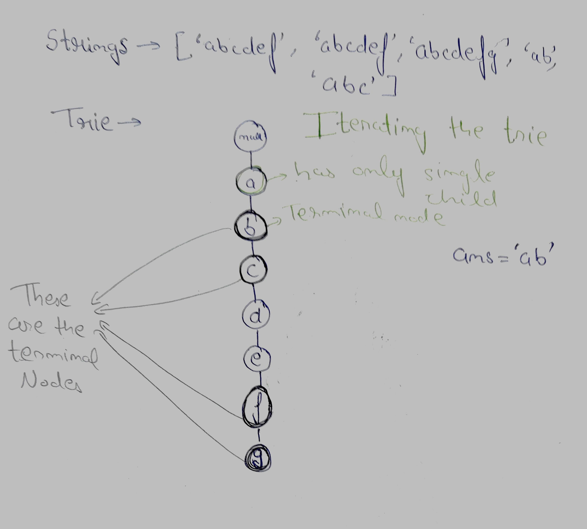
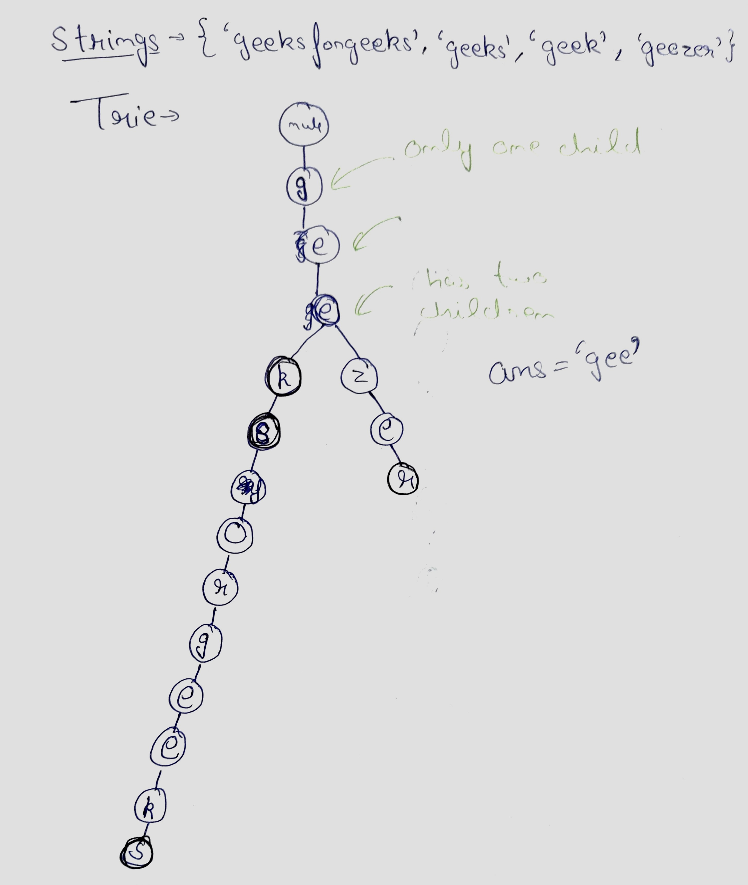

# Longest Common Prefix

## Question

https://www.geeksforgeeks.org/problems/longest-common-prefix-in-an-array5129/1

Given an array of N strings, find the longest common prefix among all strings present in the array.

```
Example 1:

Input:
N = 4
arr[] = {geeksforgeeks, geeks, geek,
         geezer}
Output: gee
Explanation: "gee" is the longest common
prefix in all the given strings.
```

```
Example 2:

Input:
N = 2
arr[] = {hello, world}
Output: -1
Explanation: There's no common prefix
in the given strings.
```

Your Task:<br>
You don't need to read input or print anything. Your task is to complete the function longestCommonPrefix() which takes the string array arr[] and its size N as inputs and returns the longest common prefix common in all the strings in the array. If there's no prefix common in all the strings, return "-1".

Expected Time Complexity: O(N\*min(|arri|)).<br>
Expected Auxiliary Space: O(min(|arri|)) for result.

Constraints:<br>
1 ≤ N ≤ 10<sup>3</sup><br>
1 ≤ |arri| ≤ 10<sup>3</sup>

## Approach

1. Insert each word in a Trie.
2. Start Iterating the trie, if any character has more than one children or the character is end of any word, then the longest common prefix ends there.
3. Else push that character into answer.

## Exanples

### Example 1



### Example 2



## Code

```cpp
class TrieNode{
      public:
      char data;
      int childCount;
      TrieNode* children[26];
      bool terminal;

      TrieNode(char ch){
          data = ch;
          for(int i = 0; i<26; i++){
                children[i] = nullptr;
          }
          childCount = 0;
          terminal = false;
      }
  };

  void insert(string word, TrieNode* root){
      if(word.length() == 0){
          root->terminal = true;
          return;
      }

      int index = word[0] - 'a';

      if(root->children[index] != nullptr){
          insert(word.substr(1), root->children[index]);
      }
      else{
          TrieNode* t = new TrieNode(word[0]);
          root->children[index] = t;
          root->childCount++;
          insert(word.substr(1), root->children[index]);
      }
  }

  void iterateTrie(TrieNode* root, string &ans, string word){
      if(root->childCount != 1 || word.length() == 0 || root->terminal){
          return;
      }

      int index = word[0] - 'a';

      ans.push_back(word[0]);

      iterateTrie(root->children[index], ans, word.substr(1));
  }

    string longestCommonPrefix (string arr[], int N)
    {
        TrieNode* root = new TrieNode('\0');
        for(int i = 0; i<N; i++){
            insert(arr[i], root);
        }

        string ans;
        iterateTrie(root, ans, arr[0]);

        return (ans.length() == 0)?"-1":ans;
    }
```
